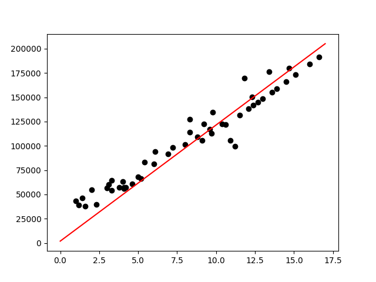

# Simple Linear regression Implementation
Salary DataSet with Years Of Experince against Salary Amount
## Cost function 
- Mean Square = 1/m ((m*x +b) -y)^2
- learning rate = 0.0005
- Gradient descent algorithm 
- 300 iterations through the data set to get weights/parameters value (m,b)
## Final graph after completion 
- black dots : data set points
- red line : predicted values

